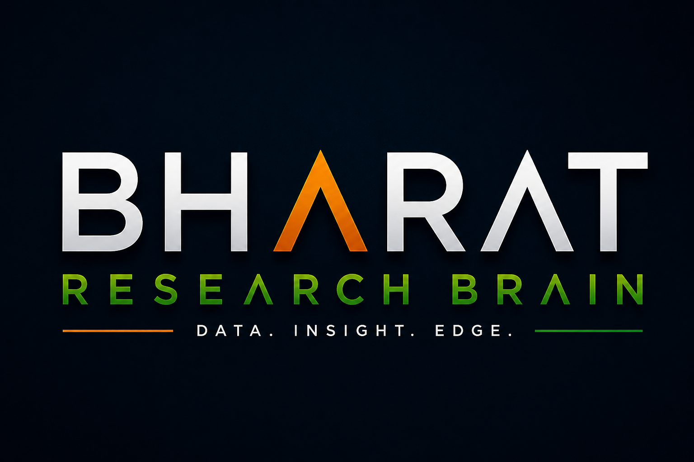

<p align="center">
  
</p>

<h2 align="center">Bharat Research Brain</h2>
<h4 align="center">Autonomous equity research system for Indian markets — two systems, one brain</h4>

<p align="center">
  507 NSE/BSE stocks &nbsp;·&nbsp; 27 agents total &nbsp;·&nbsp; Ranked daily &nbsp;·&nbsp; Self-learning &nbsp;·&nbsp; Fully local &nbsp;·&nbsp; ₹0/month
</p>

<p align="center">
  
  
  
  
  
  
  
</p>

---

## The idea in one sentence

> Instead of spending 2 hours every morning manually screening stocks, BharatBrain does it automatically overnight — and hands you a ranked, cited watchlist of the top setups before market opens at 9:15 AM.

---

## Two systems. One brain.

BharatBrain is actually two separate projects working together:

```
┌─────────────────────────────────────────────────────────────┐
│  bharat-research-brain  (this repo)  — The Engine           │
│                                                              │
│  Collects data · Computes signals · Stores in PostgreSQL     │
│  Serves everything via FastAPI on port 8000                  │
│                                                              │
│  507 stocks · 522,677 price rows · 21 tables · ₹0/month     │
└──────────────────────────┬──────────────────────────────────┘
                           │  HTTP only — reads, never writes
                           ▼
┌─────────────────────────────────────────────────────────────┐
│  bharat-brain-agents  — The Analyst (Hermes layer)          │
│                                                              │
│  Reads signals · Runs 13 specialist agents · Ranks stocks    │
│  Writes daily report to Obsidian · Self-learns from outcomes │
│                                                              │
│  13 agents · 507 stocks · 52.7 min/run · 0 crashes          │
└─────────────────────────────────────────────────────────────┘
```

**Simple analogy:**
- **bharat-research-brain** = a Bloomberg terminal you built yourself. Knows everything about every stock. Raw data, no opinions.
- **bharat-brain-agents (Hermes)** = a portfolio analyst sitting at that terminal. Reads the data, forms opinions, ranks stocks, writes reports, and learns from its mistakes every single day.

| The engine answers | The analyst answers |
|--------------------|---------------------|
| What is Reliance's RSI right now? | Which 20 stocks should I watch today? |
| What was HDFC Bank's price on 3 Jan 2023? | Is the market Risk-On or Risk-Off? |
| Which stocks had a golden cross today? | What are the 3 best setups with support/resistance zones? |
| What is the FII flow this week? | Which sectors are institutions rotating into? |

---

## Current numbers

| Metric | Value |
|--------|-------|
| Stocks in universe | 507 (Nifty 500 + Midcap 150) |
| Price rows (adjusted) | 522,677 |
| Trading days loaded | 1,229 |
| Corporate events | 2,898 (splits + dividends) |
| DB migrations | 23 |
| DB tables | 21 |
| Engine agents | 14 |
| Analyst agents (Hermes) | 13 |
| Git commits | 44+ engine · 15+ Hermes |
| Tests passing | 311 |
| Stress test | 507 stocks × 13 agents = 6,591 runs — 0 crashes |
| Pipeline duration | ~154s engine · ~52.7 min Hermes (full 507) |
| Monthly cost | ₹0 |

**Latest signal distribution:**

| Label | Count | Score range |
|-------|-------|-------------|
| `Strong Bullish Watch` | 15 | 75–100 |
| `Bullish Watch` | 38 | 65–74 |
| `Neutral Watch` | 246 | 50–64 |
| `Cautious` | 200 | 20–49 |
| `Avoid` | 8 | < 20 |

---

## Part 1 — The Engine (bharat-research-brain)

### The 14-agent nightly pipeline

Every evening at **18:30 IST** (Mon–Fri), 14 agents run in sequence. One agent failing does not stop the rest.

```
Universe → Price → Adjusted Price → Technical → News → Sentiment
       → Fundamentals → Sector → FII/DII → Macro → Risk
       → Ranking → Report → Meta-Auditor
```

| # | Agent | What it does |
|---|-------|-------------|
| 1 | **Universe** | Validates all 507 stocks, flags any NSE/BSE index rebalancing |
| 2 | **Price** | Reads NSE bhavcopy CSV, inserts OHLCV rows into PostgreSQL |
| 3 | **Adjusted Price** | Applies split/bonus correction factors to all historical prices |
| 4 | **Technical** | RSI(14), EMA(20/50/200), MACD, ATR, volume signal, 52-week proximity, delivery % |
| 5 | **News** | 6 RSS feeds + Upstox News API — matches headlines to stocks by ISIN |
| 6 | **Sentiment** | Local FinBERT (no API) — bull/bear/neutral classification per headline |
| 7 | **Fundamentals** | PE, ROE, D/E, FCF, quarterly P&L trends, dividend yield via yfinance |
| 8 | **Sector** | 19 sectors classified as leading / neutral / lagging |
| 9 | **FII/DII** | SEBI institutional flow data, 5-day rolling net signal |
| 10 | **Macro** | India VIX, USD/INR, Brent crude, Nifty vs 200d EMA → regime label |
| 11 | **Risk** | Per-stock penalty (0–15 pts): ATR volatility, news spikes, earnings proximity, promoter pledges |
| 12 | **Ranking** | Combines all signals → 0–100 composite score + signal label |
| 13 | **Report** | Structured daily research note → PostgreSQL + Obsidian vault |
| 14 | **Meta-Auditor** | Fact-checks every claim against the DB. Fail-closed — 5 rules, all must pass |

### The engine scoring formula

```
composite_score =
    (technical_score  × 0.35)   ← RSI zone, EMA stack, MACD, volume trend, 52-week proximity
  + (fundamental_score × 0.40)  ← PE (sector-relative), ROE, D/E, FCF, quarterly trend, dividends
  + (macro_score       × 0.25)  ← FII signal, sector signal, macro regime
  + sentiment_adj  (±5)         ← FinBERT per-stock news sentiment
  − risk_penalty   (0–15)       ← volatility, news spikes, earnings proximity, pledge flag

= composite_score (0–100, clamped)
```

### The Meta-Auditor's 5 rules

The daily report is rejected if any fail:

1. Every cited score must match the exact database value
2. Every cited headline must have a URL in `news_articles`
3. No banned advisory language ("buy", "sell", "guaranteed", "tip")
4. Disclaimer block must be present
5. All source dates must match the database

### Engine data sources

| Source | Data | How it enters |
|--------|------|--------------|
| NSE bhavcopy | Daily OHLCV — 507 stocks | Operator download → file ingest |
| Yahoo Finance | PE, ROE, D/E, FCF, fundamentals | API (free) |
| Frankfurter API | USD/INR | API (free) |
| SEBI FPI files | FII/DII institutional flows | Operator download → file ingest |
| Upstox News API | Stock-specific news per ISIN | API (free with account) |
| RSS (6 sources) | ET Markets, Mint, BS, Moneycontrol, NSE, BSE | feedparser |
| Moneycontrol | Delivery %, earnings calendar | Operator download → file ingest |

> NSE website scraping is prohibited by their Terms of Use. All NSE data enters via manually downloaded exchange-published files.

---

## Part 2 — The Analyst: Hermes Agent Layer (bharat-brain-agents)

The analyst layer reads the engine via HTTP and runs 13 specialist agents to produce the final ranked report. It was built ahead of schedule (Phase 6) and is fully tested on 507 stocks.

### Architecture

```
bharat-brain-agents/
├── orchestrator.py              ← Master runner — 13 agents, Redis-cached, 507 stocks
├── base_agent.py                ← Base class — memory, domain walls, HTTP client
├── config.yaml                  ← API URL, vault path, Redis, schedule
├── agents/
│   ├── market_breadth_agent.py  ← Agent 0 — runs ONCE, result shared with all 507 stocks
│   ├── universe_agent.py        ← Agent 1
│   ├── fundamentals_agent.py    ← Agent 2
│   ├── financial_agent.py       ← Agent 3 — dividends, cashflow, quarterly trend
│   ├── technicals_agent.py      ← Agent 4 — RSI, MACD, EMA, VWAP, VCP pattern
│   ├── macro_agent.py           ← Agent 5 — RBI, FII/DII, S&P500, sector-specific
│   ├── sector_rotation_agent.py ← Agent 6
│   ├── sentiment_agent.py       ← Agent 7 — FinBERT + RSS feeds
│   ├── screener_agent.py        ← Agent 8 — 26 pass/fail screens
│   ├── risk_agent.py            ← Agent 9 — ATR, F&O ban, earnings, PCR, insider
│   ├── ranking_agent.py         ← Agent 10 — composite score
│   ├── report_agent.py          ← Agent 11 — 2,000-word Obsidian report
│   └── outcome_agent.py         ← Agent 12 — self-learning + XGBoost training
├── data/
│   ├── fii_dii_latest.csv       ← Real SEBI FII/DII data
│   ├── nse_bulk_deals.csv       ← 91 real bulk trades
│   ├── nse_block_deals.csv      ← 29 real block trades
│   ├── nse_short_deals.csv      ← 229 real short positions
│   ├── xgboost_training.csv     ← Accumulates daily — feeds Phase 5 ML
│   ├── outcome_log.csv          ← Win/loss per pick
│   └── latest_run.json          ← Dashboard data feed
└── backtest/
    └── backtest_orchestrator.py ← Isolated — never touches live system
```

### The 13-agent pipeline

```
Market Breadth (runs once — sets regime for all 507)
         ↓
Universe → Fundamentals → Financial → Technicals →
Macro → Sector Rotation → Sentiment → Screener →
Risk → Ranking → Report → Outcome
         ↓
Obsidian vault + XGBoost CSV + latest_run.json
```

#### Agent 0 — Market Breadth
Runs once before any individual stock. Result is shared with all 507.

- Advance/Decline ratio, % stocks above EMA200, new 52-week highs vs lows
- Outputs Health Score 0–100 → Risk-On (>65) / Cautious (40–65) / Risk-Off (<40)
- **Impact on every stock:** Risk-On → no change · Cautious → all stocks −5 · Risk-Off → all stocks −15

#### Agent 4 — Technicals (includes VCP)
Beyond standard RSI/MACD/EMA, includes Minervini's Volatility Contraction Pattern:

```
Trend Template    25%  price > 50MA > 200MA
Contraction Quality 25%  2-4 tightening price contractions
Volume Dry-Up     20%  declining volume during the base
Pivot Proximity   15%  within 5% of resistance
Relative Strength 15%  outperforming Nifty 500

VCP score ≥ 60 → +10 pts in final technical score
```

#### Agent 5 — Macro (sector-specific signals)
The macro agent goes beyond market-wide regime and fires sector-specific signals:

```
IT stocks:    USDINR > 92 = +10   (weak rupee = higher USD earnings)
BFSI:         Repo rate < 6% = +8 · > 7% = -10
Pharma:       USFDA approval = +10 · USDINR > 90 = +5
Auto:         Crude +5% monthly = -10  (input cost pressure)
Energy:       Crude +3% = +12 · Crude -3% = -8
FMCG:         CPI < 5% = +8 · CPI > 6% = -8
```

#### Agent 6 — Sector Rotation
Uses real NSE bulk/block deal CSVs (91 bulk trades, 29 block trades loaded):

```
STRONG INFLOW sector:   +20 to each stock in that sector
MODERATE INFLOW:        +12
NEUTRAL:                 0
MODERATE OUTFLOW:       -12
STRONG OUTFLOW:         -20

Bonus: sector leader + sector rotating in = +8 extra
Bonus: rotation reversal (first week of new inflow) = +15
```

#### Agent 9 — Risk (insider + options signals)
Goes well beyond standard volatility:

- **Bulk deals:** 3 institutions buying same stock same day → +20
- **Block deals:** quality MF buy (HDFC/SBI/Nippon) → +15
- **Short squeeze:** >22% short interest + price rising → +10
- **PCR:** > 1.5 (extreme fear) → +12 contrarian bullish · < 0.5 (extreme greed) → −15
- **Insider:** CEO/MD buying > ₹1Cr → +18 to +36 · Director selling >10% holdings → −15 to −20
- **SEBI notice:** instant −25

#### Agent 10 — Ranking (Hermes formula)

```
Fundamentals     × 0.28
Financial        × 0.18   ← dividends, cashflow, earnings quality
Technicals       × 0.27
Macro            × 0.15
Sector Rotation  × 0.12

+ sentiment modifier  ±5%
− risk penalty        0 to -15
− breadth adjustment  0 / -5 / -15

= final score 0-100
```

This formula will be replaced by XGBoost at Day 90.

#### Agent 11 — Report (what you get every morning)

A 2,000-word Obsidian markdown report covering:

```
Today's Changes        which stocks moved tiers, biggest movers, sector shifts
Macro Environment      regime, FII flows, VIX, USD/INR, S&P500 overnight
Sector Rotation        rotating in / out / neutral with flow data
Top 20 Watchlist       full score breakdown: F / Fin / T / M / SR per stock
3 High-Conviction      all 13 agent scores, key signals, support/resistance zones
Meta-Auditor           ✅ all claims verified against raw database values
Disclaimer             personal research only, not SEBI-registered advice
```

#### Agent 12 — Outcome (the learning engine)
Runs at **15:45 IST** daily — after market close:

1. Reads yesterday's watchlist from the Obsidian vault
2. Fetches today's actual closing prices from the engine API
3. Was the predicted direction correct? → logs to `outcome_log.csv`
4. Appends a training row to `xgboost_training.csv` (20 features per stock)
5. Writes accuracy learnings to each agent's `memory.md`
6. Broadcasts cross-agent insights (e.g. which macro conditions degraded signal accuracy)

### The integration contract

Two systems, three communication channels:

```
Channel 1 — HTTP (primary data pipe)
  Hermes calls → GET http://localhost:8000/api/v1/
  Engine answers → JSON
  Hermes NEVER writes to the engine

Channel 2 — Obsidian vault (shared output)
  Engine writes → vault/stocks/{isin}.md
  Hermes writes → vault/bharat-brain/reports/YYYY-MM-DD.md
  Hermes writes → vault/bharat-brain/agents/{name}/memory.md

Channel 3 — XGBoost CSV (feedback loop)
  Hermes writes → data/xgboost_training.csv (daily)
  Phase 5 reads → trains XGBoost from this CSV
  Phase 5 outputs → updated weight config → both systems benefit
```

**To switch from mock data to real data — one line in config.yaml:**

```yaml
api:
  base_url: "http://localhost:8000/api/v1/"  # was: localhost:8001 (mock)
```

That's all. 13 agents, 507 stocks, real signals.

---

## The self-learning loop

Every day the system gets a little smarter. Here's exactly how:

```
Day 1 morning (6 AM)
  13 agents score all 507 stocks
  Top 20 written to Obsidian report
  All agent memories read at start of each run

Day 1 afternoon (3:45 PM)
  Outcome agent fetches closing prices
  "Reliance scored 86.7 — bullish-watch. It went up 1.2%. Correct."
  Logs win/loss. Appends training row to xgboost_training.csv.

Day 2 morning
  Technicals agent reads its memory.md:
  "RSI 55-65 in Pharma: 73% accurate last week"
  Slightly higher weight on Pharma RSI signals → rankings shift

Day 30
  600+ training rows accumulated
  XGBoost trained: which feature combinations predict returns?
  F×0.28 + T×0.27... replaced with learned weights
  Feature importance reveals: what actually works in Indian markets?

Day 60
  1,200 rows. Threshold tuning.
  "RSI 55-65 beats RSI 50-70 by 13% in this market"
  Screener thresholds updated automatically.

Day 90
  1,800+ rows. XGBoost is the ranking engine.
  Manual formula fully retired.
  Walk-forward backtest: does it beat Nifty 50 buy-and-hold?
  If yes → system has proven edge. Use it.
```

**XGBoost training features (20 per stock, per day):**
`f_score, fin_score, t_score, m_score, sr_score, risk_score, rsi_14, macd_hist, price_vs_ema200, pe_ratio (sector-relative), roe, revenue_growth, fii_signal, macro_regime, india_vix, vcp_score, pcr, days_to_results, volatility_flag, actual_5d_return`

---

## What the terminal looks like

```
╔══════════════════════════════════════════════════════════╗
║         BharatBrain Live Dashboard — 27 May 2026        ║
╠══════════════════════════════════════════════════════════╣
║  Macro: 🟡 Cautious  │  FII: -₹2,408Cr  │  VIX: 18.2  ║
║  USDINR: 95.33 ⚠    │  S&P: +0.8% 🟢   │  Crude +1.2% ║
╠══════════════════════════════════════════════════════════╣
║  SECTOR ROTATION                                         ║
║  🟢 IN:  BFSI +1.8%  Energy +2.1%  Pharma +0.9%        ║
║  🔴 OUT: IT -1.4%    Metals -2.8%  FMCG -0.6%          ║
╠══════════════════════════════════════════════════════════╣
║  TOP 5 TODAY                        Score   Rating       ║
║   1. Reliance Industries             86.7   ●●●●● STRONG ║
║   2. HDFC Bank                       80.7   ●●●●● STRONG ║
║   3. ICICI Bank                      78.2   ●●●●  WATCH  ║
║   4. Sun Pharma                      76.1   ●●●●  WATCH  ║
║   5. ABB India                       74.1   ●●●   WATCH  ║
╠══════════════════════════════════════════════════════════╣
║  AGENT STATUS          Last Run   Status                 ║
║  Market Breadth        06:00      ✅ 88/100 Risk-On      ║
║  Universe              06:01      ✅ 507 stocks          ║
║  Technicals            06:04      ✅ VCP active          ║
║  Sector Rotation       06:06      ✅ BFSI inflow wk3     ║
║  Risk                  06:09      ✅ PCR + Insider live  ║
║  Ranking               06:10      ✅ 507 scored          ║
║  Report                06:11      ✅ Obsidian written    ║
║  Outcome               16:01      ✅ XGBoost +20 rows    ║
╠══════════════════════════════════════════════════════════╣
║  XGBoost: Day 7 / 90  ████░░░░░░░░░░░░░░░░  140 rows   ║
╚══════════════════════════════════════════════════════════╝
```

### Stock deep-dive in 2 seconds

```bash
bharat analyze SUNPHARMA
```

```
1. Snapshot          price, change, 52-week range, market cap
2. Technical signals RSI, MACD, EMA stack, VCP score
3. Fundamentals      PE, ROE, FCF, D/E, quarterly trend
4. Sentiment         recent headlines + FinBERT confidence
5. Sector context    is Pharma leading or lagging right now?
6. FII/DII flows     institutional direction (5-day rolling)
7. Macro regime      risk-on / cautious / risk-off and why
8. Risk flags        volatility, F&O ban, earnings proximity, insider activity
9. Composite score   0-100 breakdown: engine score + Hermes score
```

---

## Full data flow

```
NSE/BSE
  │ bhavcopy CSV (18:30 IST)
  ▼
bharat-research-brain (engine)
  │ 14 agents: price → technical → fundamental → sentiment
  │ → sector → FII/DII → macro → risk → ranking → report
  ▼
PostgreSQL 16 (21 tables · 522k rows)
FastAPI port 8000
  │
  │ HTTP reads only
  ▼
bharat-brain-agents (Hermes)
  │ 13 agents: breadth → universe → fundamentals → financial
  │ → technicals → macro → sector rotation → sentiment
  │ → screener → risk → ranking → report → outcome
  ▼
Obsidian vault                    data/
  ├── reports/YYYY-MM-DD.md       ├── xgboost_training.csv
  ├── agents/{name}/memory.md     ├── outcome_log.csv
  └── stocks/{isin}.md            └── latest_run.json
  │
  ▼
Phase 7 Dashboard (Next.js 14)
reads FastAPI + latest_run.json
```

---

## Build phases

| Phase | Status | What it delivers |
|-------|--------|-----------------|
| 0 — Infrastructure | ✅ Done | Docker, Postgres 16, Redis, FastAPI, Ollama |
| 1 — Data spine | ✅ Done | 507 stocks, 5yr price history, corp events, adjusted prices |
| 2 — Live data | ✅ Done | Redis feed, intraday VWAP / volume z-score |
| 3 — Analytics | ✅ Done | 6 engine signal agents |
| 3.2b — Data enrichment | ✅ Done | Upstox news, delivery signals, earnings calendar, real SEBI FPI |
| 4 — Synthesis | ✅ Done | Macro, risk, ranking, report, Meta-Auditor, scheduler |
| 4.9 — Signal quality | ✅ Done | VIX override, 52-week proximity, sector-relative PE |
| 4.10 — VCP screener | ✅ Done | Minervini VCP → `stock_vcp_signals` table |
| **6 — Hermes layer** | **✅ Done** | **13-agent analyst layer — built ahead of schedule** |
| 4.11 — Sector ratios | 🔄 In progress | NIM/NPA banks, EBITDA pharma, USD revenue IT |
| 4.12 — Market breadth | 🔄 In progress | A/D ratio, % stocks above EMA200 in engine |
| 4.13 — Event patterns | ⏳ Planned | RBI moves, crude spikes, budget, elections response matrix |
| 4.14 — Zerodha live prices | ⏳ Planned | Real intraday prices via Zerodha Kite |
| 5 — Outcomes + ML | ⏳ Planned | Backtest, walk-forward validation, XGBoost (Day 30+) |
| 7 — Dashboard | ⏳ Planned | Next.js 14 UI — after Phase 5 proves signals work |

---

## Phase 7 dashboard (planned)

Built only after Phase 5 proves the signals work. Every number backed by 90+ days of validated outcome data.

**6 pages:**
1. **Overview** — Nifty level, FII flows, regime, top 5 signals, sector rotation heatmap, agent status
2. **Watchlist** — All 507 stocks ranked, filterable by sector / signal / market cap, export CSV
3. **Stock detail** — 5yr price chart with EMA/VWAP/volume, full 13-signal score breakdown, news feed, support/resistance zones
4. **Sectors** — Momentum grid (1d / 1w / 1m vs Nifty), FII+MF flow per sector, rotation chart
5. **Reports** — Last 30 daily research notes, searchable, signal distribution trends
6. **Agents** — Per-agent accuracy (30-day), XGBoost training progress, memory file viewer

---

## Stack

| Layer | Technology |
|-------|-----------|
| Language | Python 3.11 |
| API server | FastAPI (async) |
| ORM + migrations | SQLAlchemy 2.0 + Alembic (23 migrations) |
| Database | PostgreSQL 16 (pgvector + pg_trgm) |
| Cache | Redis 7 |
| Containers | Docker Compose (WSL2 backend) |
| Local NLP | FinBERT — ProsusAI/finbert via transformers |
| Local LLMs | Ollama — qwen2.5:14b, llama3.1, mistral (Phase 6+) |
| Scheduler | APScheduler (inside FastAPI) |
| Knowledge base | Obsidian vault |
| ML | XGBoost (self-learning, Day 30+) |
| Testing | pytest + ruff + mypy (strict) |
| Frontend | Next.js 14 + Tailwind + Recharts (Phase 7) |

---

## Quickstart (engine)

**Prerequisites:** Docker Desktop (WSL2), Python 3.11, Git

```bash
# 1. Clone
git clone https://github.com/rxhils/bharat-research-brain.git
cd bharat-research-brain

# 2. Configure
cp .env.example .env
# Set POSTGRES_PASSWORD, DATABASE_URL, VAULT_PATH

# 3. Start services
docker compose up -d postgres redis

# 4. Run 23 migrations
docker compose run --rm backend alembic upgrade head

# 5. Seed 507-stock universe
docker compose run --rm backend python -m backend.cli universe run

# 6. Load price history
docker compose run --rm backend python -m backend.cli price run --all

# 7. Run full engine pipeline
docker compose run --rm backend python -m backend.cli pipeline run

# 8. Analyze a stock
docker compose run --rm backend python -m backend.cli analyze RELIANCE
```

### Quickstart (Hermes analyst layer)

```bash
# After the engine is running on port 8000:
git clone https://github.com/rxhils/bharat-brain-agents.git
cd bharat-brain-agents

pip install -r requirements.txt

# Point to the real engine (default is mock on 8001)
# Edit config.yaml: base_url: "http://localhost:8000/api/v1/"

# Run the 13-agent pipeline on all 507 stocks
python orchestrator.py

# View terminal dashboard
python dashboard.py
```

---

## CLI reference

```bash
# Stock research
bharat analyze SUNPHARMA
bharat analyze --isin INE002A01018

# Rankings
bharat ranking show --signal bullish-watch --limit 20
bharat ranking show --sector Pharma

# Pipeline
bharat pipeline run
bharat pipeline status --limit 5

# Individual engine agents
bharat price run
bharat technical run
bharat sentiment run --batch-size 32
bharat fundamentals run
bharat ranking run --all
bharat report show --date today

# Data ingest
bharat fii ingest --file data/fii_dii_clean.csv
bharat delivery ingest --file data/delivery_latest.csv
bharat earnings ingest --file data/earnings_calendar.csv
```

---

## Engine architecture

```
bharat-research-brain/
├── alembic/                 # 23 DB migrations
├── backend/
│   ├── agents/              # 14 engine agents
│   │   ├── universe.py      # 507 stocks, ISIN as canonical key
│   │   ├── price.py         # NSE bhavcopy ingest
│   │   ├── adjusted_price.py# split/bonus correction engine
│   │   ├── technical.py     # RSI, MACD, EMA, ATR, volume
│   │   ├── news.py          # RSS + Upstox + bulk/block deal ingest
│   │   ├── sentiment.py     # local FinBERT scoring
│   │   ├── fundamentals.py  # yfinance + FCF + quarterly trends
│   │   ├── sector.py        # 19-sector classification + scoring
│   │   ├── fii_dii.py       # institutional flow signals
│   │   ├── macro.py         # VIX + FX + regime classifier
│   │   ├── risk.py          # per-stock risk penalty
│   │   ├── ranking.py       # 0-100 composite score
│   │   ├── report.py        # daily research note
│   │   └── meta_auditor.py  # 5-rule fact checker, fail-closed
│   ├── db/
│   │   ├── models.py        # SQLAlchemy ORM (21 tables)
│   │   └── repositories/    # data access, no business logic
│   ├── services/
│   │   ├── vault.py         # all Obsidian read/write goes here
│   │   ├── finbert.py       # local FinBERT sidecar client
│   │   └── alerts.py        # Telegram + email
│   ├── orchestration/
│   │   └── scheduler.py     # APScheduler — 18:30 IST M-F
│   └── cli.py               # Typer CLI entrypoint
├── services/finbert/        # FinBERT sidecar — FastAPI + transformers
└── data/                    # operator-downloaded CSVs (gitignored)
```

---

## How it compares

| | BharatBrain | Typical retail | Mid-tier PMS |
|--|---|---|---|
| Stocks covered | 507 | 20–50 manually | 50–200 |
| Data freshness | Next morning | Days / weeks | Real-time (paid) |
| Signals | 20+ dimensions | 2–3 manually | 5–10 |
| Citation | Every claim cited | None | Partial |
| Self-improving | Yes (Day 30+) | No | Rarely |
| Cost | ₹0/month | ₹2k–₹10k/month | 1–2% AUM fee |
| Private | 100% local | Depends | No |

**Honest assessment:**
- Better than 95% of retail traders and most professional PMS setups for systematic screening
- Comparable to a well-resourced family office data pipeline
- Not as good as top quant funds (Quant AMC, IIFL) — they have proprietary data, decades of validation, co-located execution
- **The real edge:** systematic, cited, self-improving, ₹0 cost, 100% private, running while you sleep

---

## Compliance

This system is for **personal research only.**  
Output is never used for advisory services.  
Not registered with SEBI as an investment adviser.  
No order-placement code exists anywhere in this repository.  
See `CLAUDE.md §2` for the complete hard rules and personal-use scope lock.

---

## License

Private — personal research use only.
