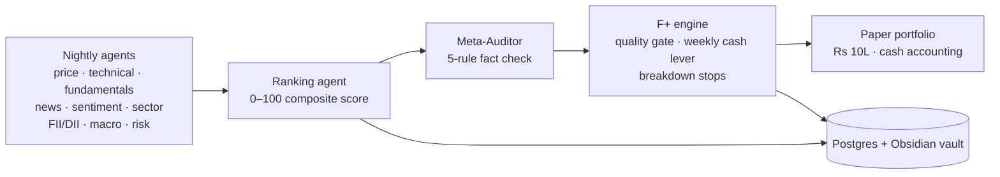

# bharat-research-brain

A personal research engine for Indian equities (NSE/BSE). Every night it scores
~507 stocks across technical, fundamental, news, flow, and macro signals, and runs
a **validated, risk-managed portfolio strategy (F+)** on top of those scores.

It is a research tool, run locally, paper-traded only. It is **not** a trading bot,
not advisory, and not a SaaS. See [Disclaimer](#disclaimer).

---

## What it is

- A nightly multi-agent pipeline that ingests prices, fundamentals, news, FII/DII
  flows, and macro data, then produces a 0–100 composite score per stock with a
  source-cited audit trail.
- A backtesting harness that pits candidate portfolio strategies (configs **A → F+**)
  against the Nifty 500 TRI across two market eras, with pre-registered pass/fail
  bars and strict no-lookahead discipline.
- A forward paper-trading layer that runs the frozen, validated **F+** engine on
  Rs 10L of paper capital to build an honest out-of-sample track record.

---

## The honest result

**F+ delivers index-like returns with roughly half the drawdown.** Its edge is
**risk management and consistency, not beating the market on raw return.**

| Period | F+ return | Index (Nifty 500 TRI) | F+ max drawdown | Index max drawdown |
|---|---:|---:|---:|---:|
| 2017–2020 (incl. COVID) | +40.99% | +62.45% | **23.27%** | 38.52% |
| COVID window only | — | — | **−26.93%** | −38.52% |
| 2021–2026 | +81.60% | +82.17% | 18.95% | 18.59% |

Plainly:

- F+ **survived COVID** — its worst drawdown through the crash was about **−27% vs
  the market's −38%** — because a weekly cash lever cut exposure *before* the 23-Mar
  2020 bottom.
- Over 2021–2026 it **beat the index in all 4 walk-forward windows** (Sharpe up to
  1.56) and roughly **matched** the index over the full period.
- It does **not** beat the market on raw return. A concentrated, always-invested
  strategy (Config C) made far more in the bull run (+221%) — but fell ~43–55% in
  COVID. F+ trades that upside for survivability.

No parameters were tuned after seeing results. Full detail: [docs/VALIDATION.md](docs/VALIDATION.md).

---

## The validation journey

Configs A through F+ were each tested across two eras (2017–2020 incl. COVID, and
2021–2026) against the Nifty 500 TRI, with pre-registered bars set *before* the run.
**F+ is the only config that passed its bar.**

| Config | What it tried | Verdict |
|---|---|---|
| A / B  | Cash-floor allocators | "Won" only by hiding in cash — unusable |
| C      | Always-invested momentum | Leveraged beta; **−57% in COVID**, lost to a passive index over 2017–2020 |
| D      | Diversification (sector caps, trailing stops) | Drawdown unchanged — it's market beta, not single-name risk |
| E      | Defensive regime rotation | Still 100% long the market; defensives fell too |
| F      | Quality + cash, low turnover | Right idea, but the cash lever fired ~2 months too late in COVID |
| **F+** | Quality + **weekly** cash lever + breakdown stops | **PASSED both eras** ✓ |

The structural lesson the journey proved: **you cannot have "always invested" *and*
"low drawdown" in a long-only book** — portfolio drawdown is market exposure.
F+ works because it can actually step out of the market (to cash) fast enough to
matter. It is risk management, not alpha.

---

## Architecture



Data flows one direction: agents write signals → the ranking agent merges them into
a composite score → the Meta-Auditor rejects any claim without evidence → the F+
engine turns scores into a sized, cash-managed portfolio. Postgres is canonical for
numbers; the Obsidian vault is canonical for human-readable prose and lessons.

Deeper view: [docs/ARCHITECTURE.md](docs/ARCHITECTURE.md).

---

## Stack

| Layer | Technology |
|---|---|
| Language | Python 3.11 (type hints, `mypy --strict`) |
| API server | FastAPI (async) |
| ORM + migrations | SQLAlchemy 2.0 + Alembic |
| Database | PostgreSQL 16 (pgvector + pg_trgm) |
| Cache | Redis 7 |
| Containers | Docker Compose |
| LLM | DeepSeek API (`deepseek-chat`) |
| Sentiment NLP | FinBERT (ProsusAI/finbert) — local, in-process |
| Scheduler | APScheduler (in FastAPI) |
| Knowledge base | Obsidian vault (markdown + frontmatter) |
| Testing / lint | pytest · ruff · mypy |
| Frontend | Next.js 14 + Tailwind (dashboard, early) |

---

## How to run

**Prerequisites:** Docker Desktop, Python 3.11, Git.

```bash
# 1. Clone
git clone https://github.com/rxhils/bharat-research-brain.git
cd bharat-research-brain

# 2. Configure — copy the template and fill in real values.
#    .env is gitignored; never commit real keys. See .env.example for every key.
cp .env.example .env
#    Set at minimum: POSTGRES_PASSWORD, POSTGRES_URL, VAULT_PATH, DEEPSEEK_API_KEY

# 3. Start infra
docker compose up -d postgres redis

# 4. Apply DB migrations
docker compose run --rm backend alembic upgrade head

# 5. Seed the 507-stock universe
docker compose run --rm backend python -m backend.cli universe run

# 6. Load price history
docker compose run --rm backend python -m backend.cli price run --all

# 7. Run the full nightly pipeline
docker compose run --rm backend python -m backend.cli pipeline run

# 8. Analyze one stock
docker compose run --rm backend python -m backend.cli analyze RELIANCE
```

**Run a backtest** (read-only against stored adjusted prices):

```bash
# Walk-forward / full-period backtest harness lives in backend/backtest/
docker compose run --rm backend python -m backend.backtest.runner
```

**Common CLI commands:**

```bash
bharat analyze SUNPHARMA                       # full per-stock breakdown
bharat ranking show --signal bullish-watch     # ranked watchlist candidates
bharat pipeline run                            # full nightly pipeline
bharat fii ingest --file data/fii_dii_clean.csv
```

---

## Status

**Done**
- Backtesting validation: configs A–F+ across two eras with pre-registered bars and
  no-lookahead discipline. F+ passed both eras and is **frozen** (engine code is
  not modified by ongoing work).
- The 14-agent nightly scoring pipeline + Meta-Auditor.

**In progress**
- Forward paper-trading layer running the frozen F+ engine (`backend/paper/`) — built
  and runnable locally; hosted-DB + cloud-cron go-live is an operator step.
- "Maven" — a 2-screen dashboard for the F+ paper portfolio (`maven-dashboard/`).

**Next**
- Per-niche / sector-specific variants of the strategy.
- Agentic forward validation: once live API keys are wired, test whether the agent
  signals add value over the mechanical composite F+ was validated on.

---

## Disclaimer

For personal research and educational purposes only. **Not investment advice.** The
operator has not paid for advice and Claude is not registered as an investment adviser
or research analyst with SEBI. This is paper-traded — **no real money, no order
placement** — and there is no order-placement code anywhere in this repository.
See [`CLAUDE.md`](CLAUDE.md) §2 for the full hard rules and personal-use scope.

---

## License

Private — personal research use only. All rights reserved.

---

## Repository map

One line per top-level entry. Fuller version: [docs/STRUCTURE.md](docs/STRUCTURE.md).

| Path | What it is |
|---|---|
| `backend/` | FastAPI app — agents, DB models, services, CLI |
| `backend/backtest/` | Validated backtest harness (`engine.py`, `runner.py`, `scores.py`) — configs A–F+ |
| `backend/paper/` | Forward paper-trading layer running the frozen F+ engine |
| `alembic/` | Database migrations |
| `scripts/` | Operator/ops scripts — data ingest, backfills, nightly run, diagnostics |
| `services/finbert/` | Local FinBERT sentiment sidecar |
| `frontend/` | Next.js dashboard (early) |
| `maven-dashboard/` | Maven 2-screen F+ paper-trading UI |
| `data/` | Operator-downloaded CSVs (gitignored) |
| `docs/` | Architecture, validation, and structure docs |
| `CLAUDE.md` / `AGENTS.md` | Project rules & conventions (read by AI assistants) |
| `DEPLOY.md` / `HOSTED_DB.md` | Deployment + hosted-DB notes |
