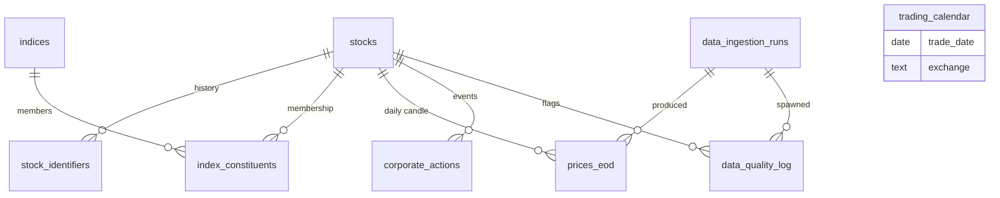

# Phase 1 — Chunk 1.1: Database schema spec

> Status: **review pending**. No code, no migrations, no models until the operator approves the open questions in §3.
>
> Scope: 9 tables + Alembic setup + seed data for `indices` and `trading_calendar`. Nothing else.

---

## 0. Conventions baked in (per CLAUDE.md and operator preconditions)

- **Time:** all `*_at` columns are `TIMESTAMPTZ` stored in UTC. Display in IST is the API/dashboard layer's job.
- **Money:** `NUMERIC(18,4)`. No floats anywhere.
- **Volume / counts:** `BIGINT`.
- **Stock identity:** `ISIN` is the canonical key (`VARCHAR(12)`). Symbols are joinable identifiers, never primary.
- **`prices_eod`:** plain (non-partitioned) table for now, but composite PK ordered so future `PARTITION BY RANGE(trade_date)` is non-breaking.
- **Ingestion provenance:** every ingestion writes one row to `data_ingestion_runs` with `source_url`, `source_name`, `downloaded_at_utc`, `file_sha256`, `row_count`, `source_trade_date`. Every `prices_eod` row references that run.
- **Backtest integrity:** queries against `index_constituents` MUST filter `effective_from <= trade_date < effective_to`. Enforced in repository layer, codified in CLAUDE.md §4.
- **Soft-delete:** not used anywhere. Delisted stocks carry `delisted_on`. Index constituents end-date via `effective_to`. No `deleted_at` columns.

---

## 1. Per-table specs

### 1.1 `stocks` — universe master

**Purpose.** Static-ish record per tradeable equity. One row per ISIN. Mutable fields (sector, mcap, fno flag) updated in place; identity changes (rename, sector reclassification) trigger an append to `stock_identifiers`.

| Column | Type | Null | Default | Description |
|---|---|---|---|---|
| `isin` | `VARCHAR(12)` | NO | — | Canonical key. INE/INF prefix + 9 alphanumeric + 1 check digit. |
| `nse_symbol` | `VARCHAR(20)` | YES | — | NSE ticker. NULL for BSE-only listings. |
| `bse_symbol` | `VARCHAR(20)` | YES | — | BSE scrip code or symbol. |
| `yfinance_symbol` | `VARCHAR(24)` | YES | — | Cached `<symbol>.NS` / `.BO` form. |
| `company_name` | `VARCHAR(255)` | NO | — | Current legal name. |
| `industry` | `VARCHAR(120)` | YES | — | NSE industry classification. |
| `sector` | `VARCHAR(80)` | YES | — | Coarse bucket (e.g., Energy, Financials). |
| `mcap_category` | `VARCHAR(8)` | YES | — | One of `large` / `mid` / `small` / `micro`. |
| `mcap_inr_cr` | `NUMERIC(18,4)` | YES | — | Latest market cap, INR crore. |
| `listed_on` | `DATE` | YES | — | First listing date. |
| `delisted_on` | `DATE` | YES | — | NULL means active. |
| `is_fno` | `BOOLEAN` | NO | `false` | F&O eligibility. |
| `lot_size_fno` | `INTEGER` | YES | — | Refreshed quarterly. |
| `last_refreshed_at` | `TIMESTAMPTZ` | NO | `now()` | Last time Universe Agent touched this row. |
| `created_at` | `TIMESTAMPTZ` | NO | `now()` | |
| `updated_at` | `TIMESTAMPTZ` | NO | `now()` | Maintained per Open Question 1. |

**Primary key.** `isin`.
**Foreign keys.** None outbound.
**Indexes.**
- `idx_stocks_nse_symbol_active` — partial unique on `(nse_symbol)` `WHERE delisted_on IS NULL`. Active-symbol uniqueness without blocking historical reuse after delisting.
- `idx_stocks_bse_symbol_active` — partial unique on `(bse_symbol)` `WHERE delisted_on IS NULL`.
- `idx_stocks_sector` — btree on `(sector)`. Sector-scoped scans.
- `idx_stocks_active` — partial btree on `(delisted_on)` `WHERE delisted_on IS NULL`. Cheap "all active stocks" enumeration.

**Constraints.**
- `CHECK (length(isin) = 12)`
- `CHECK (mcap_category IS NULL OR mcap_category IN ('large','mid','small','micro'))`
- `CHECK (delisted_on IS NULL OR listed_on IS NULL OR delisted_on >= listed_on)`

**Growth.** ~500 active + ~2,000 delisted historical over a decade. Trivial.
**Retention.** Forever. Delisted rows kept for backtests.

---

### 1.2 `stock_identifiers` — change-history audit

**Purpose.** Append-only log of identity / classification changes per stock. Never updated. Captures rename, BSE↔NSE symbol changes, sector reclassification, F&O on/off, lot-size revisions.

| Column | Type | Null | Default | Description |
|---|---|---|---|---|
| `id` | `BIGSERIAL` | NO | seq | |
| `isin` | `VARCHAR(12)` | NO | — | FK → `stocks(isin)`. |
| `identifier_type` | `VARCHAR(24)` | NO | — | One of `nse_symbol` / `bse_symbol` / `company_name` / `industry` / `sector` / `mcap_category` / `lot_size_fno` / `is_fno`. |
| `old_value` | `TEXT` | YES | — | Previous value (NULL on first observation). |
| `new_value` | `TEXT` | YES | — | New value (NULL on retirement of a field). |
| `effective_from` | `DATE` | NO | — | Date the change took effect (per source). |
| `recorded_at` | `TIMESTAMPTZ` | NO | `now()` | Insert time. |
| `source` | `VARCHAR(64)` | NO | — | e.g., `nse_archive`, `openalgo`, `manual`. |

**Primary key.** `id`.
**Foreign keys.**
- `isin` → `stocks(isin)` `ON DELETE RESTRICT`. Stocks are never deleted; FK enforces the contract.

**Indexes.**
- `idx_stock_identifiers_isin` on `(isin, effective_from DESC)`.
- `idx_stock_identifiers_type` on `(identifier_type, effective_from DESC)`.

**Constraints.**
- `CHECK (identifier_type IN ('nse_symbol','bse_symbol','company_name','industry','sector','mcap_category','lot_size_fno','is_fno'))`
- `CHECK (old_value IS NOT NULL OR new_value IS NOT NULL)`

**Growth.** ~50–200 rows/year. Trivial.
**Retention.** Forever.

---

### 1.3 `indices` — index registry

**Purpose.** Catalog of indices we track. Static-ish; new entries added when NSE launches a new index.

| Column | Type | Null | Default | Description |
|---|---|---|---|---|
| `index_code` | `VARCHAR(32)` | NO | — | Stable code, e.g., `NIFTY50`, `NIFTYBANK`. |
| `index_name` | `VARCHAR(120)` | NO | — | Display name. |
| `index_type` | `VARCHAR(16)` | NO | — | `broad` / `sector` / `thematic`. |
| `description` | `TEXT` | YES | — | |
| `created_at` | `TIMESTAMPTZ` | NO | `now()` | |
| `updated_at` | `TIMESTAMPTZ` | NO | `now()` | |

**Primary key.** `index_code`.
**Foreign keys.** None.
**Indexes.** PK only.
**Constraints.**
- `CHECK (index_type IN ('broad','sector','thematic'))`

**Growth.** ~20 rows total, near-static.
**Retention.** Forever.

---

### 1.4 `index_constituents` — slowly-changing membership

**Purpose.** Which stock was in which index, with effective-date ranges. Source of truth for survivorship-bias-free backtests. Append-only with `effective_to` close-out — existing rows are end-dated, never overwritten.

| Column | Type | Null | Default | Description |
|---|---|---|---|---|
| `id` | `BIGSERIAL` | NO | seq | |
| `index_code` | `VARCHAR(32)` | NO | — | FK → `indices(index_code)`. |
| `isin` | `VARCHAR(12)` | NO | — | FK → `stocks(isin)`. |
| `weight_pct` | `NUMERIC(8,4)` | YES | — | Latest published weight, informational. |
| `effective_from` | `DATE` | NO | — | Inclusive start. |
| `effective_to` | `DATE` | YES | — | Exclusive end. NULL = current. |
| `recorded_at` | `TIMESTAMPTZ` | NO | `now()` | |
| `source` | `VARCHAR(64)` | NO | — | |

**Primary key.** `id`.
**Foreign keys.**
- `index_code` → `indices(index_code)` `ON DELETE RESTRICT`. Indices are not deleted.
- `isin` → `stocks(isin)` `ON DELETE RESTRICT`.

**Indexes.**
- `idx_constituents_lookup` on `(index_code, isin, effective_from DESC)` — main backtest lookup.
- `idx_constituents_active` partial on `(index_code, effective_to)` `WHERE effective_to IS NULL` — fast "current members of index X".
- `idx_constituents_isin_history` on `(isin, effective_from DESC)` — reverse lookup ("which indices does this stock belong to").

**Constraints.**
- `CHECK (effective_to IS NULL OR effective_to > effective_from)`
- `UNIQUE (index_code, isin, effective_from)` — same membership cannot duplicate per start date.

**Growth.** ~7,000 active rows (500 stocks × ~14 indices avg). Quarterly reshuffles add ~200 rows/year. ~10,000 over a decade.
**Retention.** Forever. Survivorship-bias rule depends on it.

---

### 1.5 `prices_eod` — daily OHLCV + delivery

**Purpose.** End-of-day candle per (stock, trading day). Raw values from source; **no `adj_*` columns yet** — adjusted prices arrive in Phase 2.5. Designed partition-ready: composite PK `(trade_date, isin)` aligns with future `PARTITION BY RANGE(trade_date)`.

| Column | Type | Null | Default | Description |
|---|---|---|---|---|
| `trade_date` | `DATE` | NO | — | NSE/BSE trading date. |
| `isin` | `VARCHAR(12)` | NO | — | FK → `stocks(isin)`. |
| `open` | `NUMERIC(18,4)` | YES | — | |
| `high` | `NUMERIC(18,4)` | YES | — | |
| `low` | `NUMERIC(18,4)` | YES | — | |
| `close` | `NUMERIC(18,4)` | YES | — | |
| `prev_close` | `NUMERIC(18,4)` | YES | — | As reported by source. |
| `volume` | `BIGINT` | YES | — | Total traded shares. |
| `turnover_inr` | `NUMERIC(20,4)` | YES | — | Total traded value, INR. |
| `vwap` | `NUMERIC(18,4)` | YES | — | Volume-weighted avg, source-reported. |
| `delivery_qty` | `BIGINT` | YES | — | NSE-specific. |
| `delivery_pct` | `NUMERIC(7,4)` | YES | — | 0–100. |
| `trade_count` | `BIGINT` | YES | — | Number of trades, where reported. |
| `source` | `VARCHAR(32)` | NO | — | `nse_bhavcopy` / `openalgo` / `yfinance`. |
| `ingestion_run_id` | `BIGINT` | NO | — | FK → `data_ingestion_runs(id)`. |
| `inserted_at` | `TIMESTAMPTZ` | NO | `now()` | |

**Primary key.** `(trade_date, isin)` — see Open Question 4 for ordering rationale.
**Foreign keys.**
- `isin` → `stocks(isin)` `ON DELETE RESTRICT`. Never lose price history.
- `ingestion_run_id` → `data_ingestion_runs(id)` `ON DELETE RESTRICT`. Provenance must outlive the run row.

**Indexes.**
- PK serves `(trade_date, …)` lookups (daily report pattern).
- `idx_prices_eod_isin_date` on `(isin, trade_date DESC)` — single-stock history.
- `idx_prices_eod_source_date` on `(source, trade_date DESC)` — fallback-source telemetry.

**Constraints.**
- `CHECK (open IS NULL OR open >= 0)`
- `CHECK (high IS NULL OR low IS NULL OR high >= low)`
- `CHECK (delivery_pct IS NULL OR (delivery_pct >= 0 AND delivery_pct <= 100))`
- `CHECK (volume IS NULL OR volume >= 0)`
- `CHECK (source IN ('nse_bhavcopy','openalgo','yfinance'))`

**Growth.** 500 stocks × ~250 trading days = ~125,000 rows/year. ~1.25M over a decade. Comfortable on a single Postgres node, unpartitioned.
**Retention.** Forever.

---

### 1.6 `corporate_actions` — splits, bonuses, dividends

**Purpose.** Authoritative log of share-count and price-continuity events. Drives Phase 2.5 adjusted-price computation. Insert-only; corrections via new row with `description` explaining override.

| Column | Type | Null | Default | Description |
|---|---|---|---|---|
| `id` | `BIGSERIAL` | NO | seq | |
| `isin` | `VARCHAR(12)` | NO | — | FK → `stocks(isin)`. |
| `action_type` | `VARCHAR(16)` | NO | — | `split` / `bonus` / `dividend` / `rights` / `spinoff` / `merger`. |
| `ex_date` | `DATE` | NO | — | First trading day on adjusted basis. |
| `record_date` | `DATE` | YES | — | |
| `announcement_date` | `DATE` | YES | — | |
| `ratio_numerator` | `NUMERIC(12,4)` | YES | — | e.g., split 1:5 → numerator=1. |
| `ratio_denominator` | `NUMERIC(12,4)` | YES | — | e.g., split 1:5 → denominator=5. |
| `amount_inr` | `NUMERIC(18,4)` | YES | — | Per-share dividend / rights subscription price. |
| `description` | `TEXT` | YES | — | Free-form notes. |
| `source` | `VARCHAR(64)` | NO | — | |
| `created_at` | `TIMESTAMPTZ` | NO | `now()` | |

**Primary key.** `id`.
**Foreign keys.**
- `isin` → `stocks(isin)` `ON DELETE RESTRICT`.

**Indexes.**
- `idx_ca_isin_exdate` on `(isin, ex_date DESC)`.
- `idx_ca_exdate` on `(ex_date)`.

**Constraints.**
- `CHECK (action_type IN ('split','bonus','dividend','rights','spinoff','merger'))`
- `UNIQUE (isin, action_type, ex_date)`

**Growth.** ~1,000/year across the universe. ~10,000 over a decade.
**Retention.** Forever.

---

### 1.7 `trading_calendar` — exchange open/closed days

**Purpose.** Pre-loaded list of every calendar day per exchange, flagging open vs closed. Universe Agent and Price Agent gate on this. See Open Question 5 for "every day vs only open days".

| Column | Type | Null | Default | Description |
|---|---|---|---|---|
| `trade_date` | `DATE` | NO | — | Calendar date. |
| `exchange` | `VARCHAR(8)` | NO | `'NSE'` | `NSE` or `BSE`. |
| `is_open` | `BOOLEAN` | NO | — | |
| `session_type` | `VARCHAR(16)` | NO | `'regular'` | `regular` / `muhurat` / `closed`. |
| `notes` | `TEXT` | YES | — | e.g., "Republic Day", "Diwali Muhurat". |
| `created_at` | `TIMESTAMPTZ` | NO | `now()` | |

**Primary key.** `(trade_date, exchange)`.
**Foreign keys.** None.
**Indexes.**
- PK serves direct lookups.
- `idx_calendar_open` partial on `(exchange, trade_date)` `WHERE is_open` — "next/prev trading day" scans.

**Constraints.**
- `CHECK (session_type IN ('regular','muhurat','closed'))`
- `CHECK (exchange IN ('NSE','BSE'))`
- `CHECK (NOT is_open OR session_type <> 'closed')`

**Growth.** ~365 × 2 exchanges = ~730 rows/year. Trivial.
**Retention.** Forever.

---

### 1.8 `data_ingestion_runs` — agent-run provenance

**Purpose.** One row per agent invocation. Captures source, file hash, row counts, status. Every `prices_eod` row points back to a run; every `data_quality_log` event optionally references one.

| Column | Type | Null | Default | Description |
|---|---|---|---|---|
| `id` | `BIGSERIAL` | NO | seq | |
| `agent_name` | `VARCHAR(64)` | NO | — | e.g., `universe`, `price_eod`. |
| `run_id` | `UUID` | NO | `gen_random_uuid()` | Correlation key for structlog. |
| `started_at` | `TIMESTAMPTZ` | NO | `now()` | |
| `finished_at` | `TIMESTAMPTZ` | YES | — | |
| `status` | `VARCHAR(16)` | NO | `'running'` | `running` / `success` / `failed` / `partial`. |
| `source_url` | `TEXT` | YES | — | URL of artifact fetched, if any. |
| `source_name` | `VARCHAR(64)` | YES | — | e.g., `nse_archive`, `openalgo`. |
| `downloaded_at_utc` | `TIMESTAMPTZ` | YES | — | When the artifact was retrieved. |
| `file_sha256` | `CHAR(64)` | YES | — | SHA-256 of downloaded artifact. |
| `row_count` | `BIGINT` | YES | — | Rows ingested. |
| `source_trade_date` | `DATE` | YES | — | Trade date represented by the artifact (bhavcopy). |
| `error_message` | `TEXT` | YES | — | |
| `metadata` | `JSONB` | YES | — | Free-form payload. |

**Primary key.** `id`.
**Foreign keys.** None.
**Indexes.**
- `idx_ingestion_agent_started` on `(agent_name, started_at DESC)`.
- `idx_ingestion_failed` partial on `(status, started_at DESC)` `WHERE status <> 'success'`.
- `uq_ingestion_run_id` unique on `(run_id)`.

**Constraints.**
- `CHECK (status IN ('running','success','failed','partial'))`
- `CHECK (file_sha256 IS NULL OR length(file_sha256) = 64)`

**Growth.** ~10 agents × daily = ~3,650/year. Tiny.
**Retention.** Forever.

---

### 1.9 `data_quality_log` — quality events

**Purpose.** Structured warnings and errors emitted by the Data Quality Agent. Supports queries like "open errors right now" and "all stale-price warnings for ISIN X this month".

| Column | Type | Null | Default | Description |
|---|---|---|---|---|
| `id` | `BIGSERIAL` | NO | seq | |
| `ingestion_run_id` | `BIGINT` | YES | — | FK → `data_ingestion_runs(id)`. NULL for cross-run checks. |
| `isin` | `VARCHAR(12)` | YES | — | FK → `stocks(isin)`. NULL for universe-level events. |
| `severity` | `VARCHAR(8)` | NO | — | `info` / `warn` / `error`. |
| `code` | `VARCHAR(64)` | NO | — | Stable code, e.g., `STALE_PRICE`, `VOLUME_DISCREPANCY`. |
| `message` | `TEXT` | NO | — | Human-readable. |
| `context` | `JSONB` | YES | — | Structured payload (per Open Question 6). |
| `detected_at` | `TIMESTAMPTZ` | NO | `now()` | |
| `resolved_at` | `TIMESTAMPTZ` | YES | — | NULL = open. |
| `resolved_by` | `VARCHAR(64)` | YES | — | `manual` / `auto` / agent name. |

**Primary key.** `id`.
**Foreign keys.**
- `ingestion_run_id` → `data_ingestion_runs(id)` `ON DELETE SET NULL`. Quality events outlive defective run rows defensively.
- `isin` → `stocks(isin)` `ON DELETE RESTRICT`.

**Indexes.**
- `idx_dql_open` partial on `(severity, detected_at DESC)` `WHERE resolved_at IS NULL`.
- `idx_dql_isin` on `(isin, detected_at DESC)`.
- `idx_dql_code` on `(code, detected_at DESC)`.

**Constraints.**
- `CHECK (severity IN ('info','warn','error'))`

**Growth.** ~50,000/year early, dropping as ops mature.
**Retention.** `error` rows forever; `info`/`warn` archived after 1 year (mechanism deferred).

---

## 2. Cross-table

### 2.1 ER diagram

### 2.2 Naming conventions

- **Tables:** `snake_case`. Plural for collections (`stocks`, `indices`, `prices_eod`); the locked list mixes in `trading_calendar`, `data_ingestion_runs`, `data_quality_log` — see Open Question 10.
- **Columns:** `snake_case`.
- **FK columns:**
  - Surrogate-key FKs end in `_id` (e.g., `ingestion_run_id`).
  - ISIN FKs use the column name `isin` directly.
  - Index-code FKs use `index_code` directly.
- **Booleans:** `is_*` prefix (`is_open`, `is_fno`).
- **Timestamps:** `*_at` for timestamps, `*_date` for dates. `_at` is always `TIMESTAMPTZ` (UTC); `_date` is `DATE`.
- **Status / type / category:** stored as `VARCHAR(...)` plus `CHECK` constraint listing allowed values (see Open Question 2 for ENUM-vs-CHECK rationale).

### 2.3 Timestamp policy

- **Mutable parent tables** (`stocks`, `indices`, `trading_calendar`): `created_at` + `updated_at`. Maintenance per Open Question 1.
- **Append-only tables** (`stock_identifiers`, `index_constituents`, `prices_eod`, `corporate_actions`, `data_ingestion_runs`, `data_quality_log`): single insertion timestamp only (`recorded_at` / `inserted_at` / `created_at` / `started_at` / `detected_at`). No `updated_at` because rows are never updated.
- All timestamps stored as `TIMESTAMPTZ` in UTC. IST conversion only at display layer.

### 2.4 Soft-delete policy

Not used. Justifications:
- `stocks`: delisting modeled semantically via `delisted_on`.
- `index_constituents`: end-dated via `effective_to`.
- All other tables: append-only, deletion would violate audit guarantees.

If deletion ever becomes necessary (e.g., GDPR-style request — irrelevant here, no PII), it is a manual operations procedure outside the schema's contract.

---

## 3. Migration plan

### 3.1 Creation order (FK dependencies)

1. `stocks`
2. `indices`
3. `trading_calendar`
4. `data_ingestion_runs`
5. `stock_identifiers` *(FK → stocks)*
6. `index_constituents` *(FKs → stocks, indices)*
7. `corporate_actions` *(FK → stocks)*
8. `prices_eod` *(FKs → stocks, data_ingestion_runs)*
9. `data_quality_log` *(FKs → stocks, data_ingestion_runs)*

### 3.2 Seed data

| Seed | Source | Approx rows |
|---|---|---|
| `indices` | Hand-curated list: 4 broad (NIFTY50/100/200/500) + 11 sectoral (NIFTYBANK, NIFTYIT, NIFTYAUTO, NIFTYPHARMA, NIFTYFMCG, NIFTYMETAL, NIFTYENERGY, NIFTYREALTY, NIFTYFINSERVICE, NIFTYMEDIA, NIFTYPSUBANK) | ~15 |
| `trading_calendar` | NSE published holiday list 2024–2027 + BSE holiday list 2024–2027, Saturdays/Sundays = closed, weekday-non-holiday = open, Diwali muhurat sessions = `muhurat` | ~3,000 |
| `index_constituents` | **Deferred to Chunk 1.2** (Universe Agent populates) | 0 |

### 3.3 Alembic autogenerate handling

1. Define ORM in `backend/db/models.py` (canonical schema source per the operator's pick (b)).
2. Configure `alembic/env.py`:
   - `target_metadata = Base.metadata` from `backend/db/models.py`.
   - Use a sync database URL (alembic standard; introspection requires sync). Read from same `.env` but adapter swap (`postgresql+asyncpg://` → `postgresql+psycopg://` for migrations only).
3. `alembic revision --autogenerate -m "0001_initial_schema"` produces structural migration. Hand-review and patch:
   - Partial indexes (autogenerate sometimes drops the `WHERE` clause).
   - `CHECK` constraints (autogenerate omits some).
   - `gen_random_uuid()` default (requires `pgcrypto` extension via explicit `op.execute("CREATE EXTENSION IF NOT EXISTS pgcrypto")`).
4. `alembic revision -m "0002_seed_indices"` — manual data migration inserting the ~15 index rows.
5. `alembic revision -m "0003_seed_trading_calendar"` — manual data migration inserting ~3,000 calendar rows. Source data shipped as a CSV in `alembic/seeds/`.
6. `alembic upgrade head` runs cleanly against a fresh Postgres.

Update path: ORM is the source of truth. Schema changes start with model edits → `alembic revision --autogenerate` → review → commit.

---

## 4. Open questions (operator answers required before code)

Each option lists tradeoffs; recommendation noted explicitly.

### Q1. `updated_at` maintenance — trigger vs app-managed?

- **(a)** Postgres `BEFORE UPDATE` trigger sets `updated_at = now()` on every row touch. DB-level guarantee, immune to ORM bypass.
- **(b)** SQLAlchemy event listener / `onupdate=func.now()` column default. Simpler migrations; trusts every code path to use the ORM.
- **(c)** Skip `updated_at`; reconstruct change history from `stock_identifiers` + git diff of vault notes.
- **Recommend (a).** Triggers are 5 lines per table and survive raw SQL maintenance scripts. Cost: one Alembic data migration to install triggers + plpgsql helper function. Pgvector image ships plpgsql.

### Q2. Postgres native ENUMs vs `VARCHAR + CHECK`?

- **(a)** Native `CREATE TYPE … AS ENUM` for `action_type`, `severity`, `status`, `mcap_category`, etc. DB-level type safety, prettier `psql` output.
- **(b)** `VARCHAR + CHECK` constraint listing allowed values (current spec).
- **Recommend (b).** Postgres ENUM alteration is painful in production (`ALTER TYPE … ADD VALUE` is fine but reordering/removal requires recreating type and rewriting columns). `CHECK` gives equivalent correctness with one-line `ALTER TABLE` for new values.

### Q3. `stock_identifiers` modeling — change-event log vs SCD Type 2?

- **(a)** Change-event log: one row per change with `old_value`/`new_value`. Mental model = "rename happened on day X". Current `stocks` row holds canonical current value.
- **(b)** SCD Type 2: one row per `(isin, identifier_type)` with `effective_from`/`effective_to`; close out old, insert new. Querying "what was the symbol on 2023-04-15" is a single row lookup.
- **Recommend (a).** Simpler. `stocks` already holds canonical current state; "symbol on date X" is rare and computable via window function over the log. Tradeoff: SCD Type 2 is more elegant if we ever need point-in-time queries by symbol — but ISIN is point-in-time-stable, so we don't.

### Q4. `prices_eod` PK ordering — `(isin, trade_date)` vs `(trade_date, isin)`?

- **(a)** `(isin, trade_date)` — optimizes single-stock-across-time queries. Backtesting per-stock pattern.
- **(b)** `(trade_date, isin)` — optimizes single-day-across-stocks queries (daily report fan-out, cross-sectional ranking) and aligns directly with future `PARTITION BY RANGE(trade_date)`.
- **Recommend (b).** Daily-report and ranking pipelines hit "all stocks for trade_date X" much more than "all dates for ISIN X". Per-stock history queries stay fast via `idx_prices_eod_isin_date`. Partitioning later requires zero PK rework.

### Q5. `trading_calendar` — every calendar day or only trading days?

- **(a)** Every calendar day with `is_open` boolean (~3,000 rows for 4 years × 2 exchanges).
- **(b)** Only trading days where `is_open=true` (~2,000 rows); "is X a trading day" = "row exists".
- **Recommend (a).** Lets the app answer "next/prev trading day from arbitrary date" via `WHERE is_open AND trade_date > $X ORDER BY trade_date LIMIT 1` without generate_series gymnastics. Storage difference is irrelevant.

### Q6. `data_quality_log.context` — JSONB vs typed columns?

- **(a)** `JSONB` blob, agents serialize whatever they need. Quality codes evolve without schema migrations.
- **(b)** Typed columns per known check (e.g., `expected_close NUMERIC`, `actual_close NUMERIC`). Schema enforces shape.
- **(c)** Hybrid: a `code`-driven view layer that interprets JSONB for known codes, falls back to raw display.
- **Recommend (a).** Quality-check vocabulary will grow rapidly through Phase 1–2; typed columns become a migration-per-week graveyard. GIN index on `context` deferrable until actually needed.

### Q7. Numeric precision for prices — `NUMERIC(18,4)` vs higher?

- **(a)** `NUMERIC(18,4)` — current spec. ±99 trillion at 0.0001 precision (1 paise).
- **(b)** `NUMERIC(20,6)` everywhere — micro-paise precision; future-proofs against derivatives or basis-point reporting.
- **(c)** Mixed: `NUMERIC(18,4)` for OHLC, `NUMERIC(20,6)` for VWAP and `turnover_inr`.
- **Recommend (a).** NSE quotes 4-decimal precision; (b)/(c) over-engineer. CLAUDE.md §8 "Decimal not float" already satisfied.

### Q8. `indices` — enforce code allowlist via CHECK?

- **(a)** Free-form `index_code`, document conventions only.
- **(b)** `CHECK (index_code IN ('NIFTY50','NIFTYBANK',...))` enumerating known codes.
- **Recommend (a).** NSE launches new indices regularly; allowlist becomes maintenance debt. Index registry table itself enforces the catalog.

### Q9. Default `ON DELETE` behavior across all FKs?

- **(a)** `RESTRICT` everywhere (current spec). Forces explicit cleanup; prevents accidental cascading data loss.
- **(b)** `CASCADE` for child tables (deleting a stock cascades to identifiers, prices_eod, etc.) — matches "rebuild universe" intent.
- **(c)** Mixed: `RESTRICT` on prices_eod / corporate_actions (precious data), `CASCADE` on stock_identifiers / data_quality_log (rebuildable).
- **Recommend (a).** Stocks are never deleted per design (`delisted_on` instead). RESTRICT makes that contract enforceable at the FK level.

### Q10. Naming inconsistency — locked list mixes plural and singular table names.

The locked list contains plural `stocks`, `indices`, `prices_eod`, `index_constituents`, `corporate_actions`, `data_ingestion_runs`, `stock_identifiers` alongside singular `trading_calendar` and `data_quality_log`.

- **(a)** Accept locked names as-is; document the inconsistency in this spec and move on.
- **(b)** Rename `trading_calendar` → `trading_days` and `data_quality_log` → `data_quality_events` for plural consistency. Cheapest moment is now (zero code written).
- **(c)** Switch the rest to singular: `stock`, `index` (conflicts with SQL keyword), `price_eod`. Not recommended.
- **Recommend (a).** SCOPE LOCK preserves locked names. Inconsistency is cosmetic; codifying it in the spec costs one paragraph.

---

## 5. Out of scope for Chunk 1.1 (deferred — flagged for AGENTS.md if not already)

- ORM model file `backend/db/models.py` — drafted in Chunk 1.1 *implementation* (next chunk after spec approval), not in this spec.
- Universe Agent population logic — Chunk 1.2.
- Adjusted-price columns / corporate-action math — Phase 2.5.
- Index-constituents population (initial load + quarterly refresh) — Chunk 1.2.
- `index_constituents.weight_pct` automation — Chunk 1.2 / 1.5.
- Vault writer + stock-note generation — Chunk 1.6 (reordered after Price Agent).
- Live tick / intraday tables — Phase 2.

---

*End of spec. Status: review pending. Operator answers Q1–Q10 → spec updated → implementation prompt drafted.*
